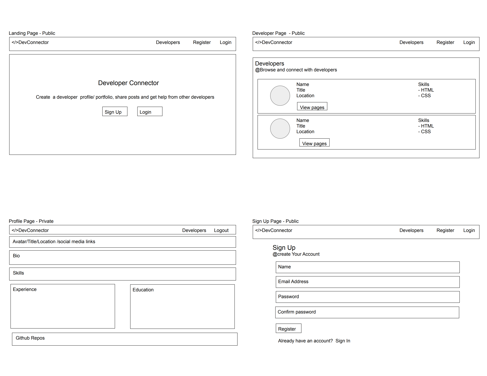
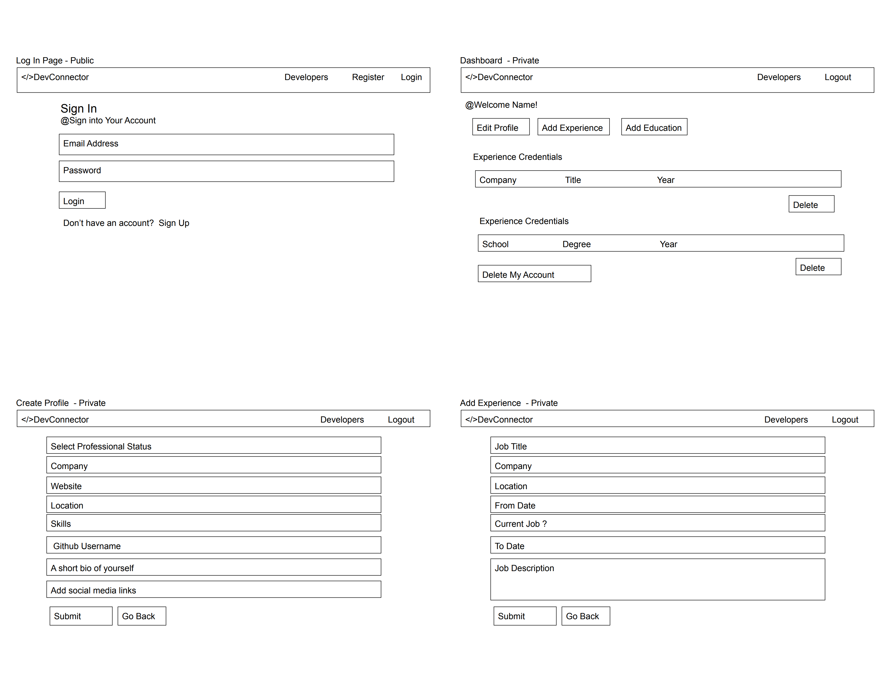
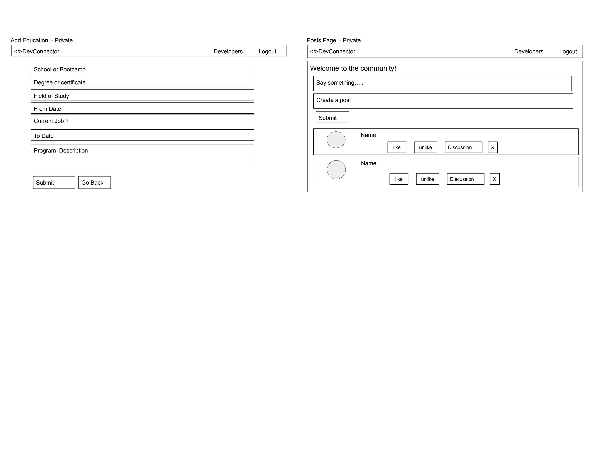
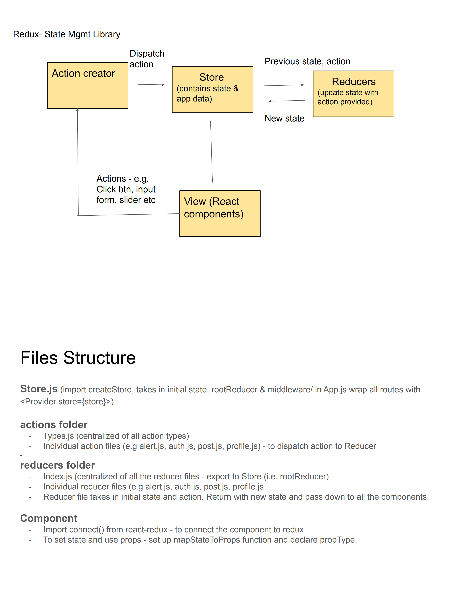

## Table of contents

- Project Title
- Project Demo
- Project Motivation
- Technologies
- Wireframes
- Project scope and implementation
- Challenges
- Improvements

## Project Title : DevConnector

## Project Demo

- https://devconnectorhelen.herokuapp.com/
- https://github.com/Helen-sew/DevConnector

## Project motivation

DevConnector is a website that allows software developer to create profile, share posts and get help from other developers.

## Technologies

- Node.js,
- Express
- React.js
  - React Router Dom
  - react Hooks
  - React Redux
- JasonWebToken
- MongoDB
- Mongoose
- CSS

Dependencies - Server side

- express
- express-validator - to do data validation
- bcryptjs - to hash password
- config - for global variables
- gravatar - for profile avatar
- jsonwebtoken - pass along a token for verification
- mongoose
- request - to do http request

devDependencies (npm i-D)

- nodemon
- concurrently - allows us run backend and frontend server at the same time with single command

Dependencis - Client side

- npx create react-app
- axios
- react-router-dom
- redux
- redux-thunk
- redux-devtools-extension
- moment
- react-moment

## Wireframes

## Project scope and implementation :

The architecture of our application is based on MVC and Microservices model. They are:

- Client Tier (Front-end/View)
  It was written in Javascript, HTML and CSS using ReactJS as the framework. User will interact with the server by accessing the features of our application.

- The Business Logic Tier (Back-end/Controller)
  It was written using NodeJS and ExpressJS, and this tier represents the Application Server that will act as a bridge of communication for the Client Tier and Database Tier. This tier will serve JSX pages to the user's device and accept HTTP requests from the user and follow with the appropriate response.

- Database Tier (Model)
  MongoDB is used to store all of the crucial data our application needs to function.

### Processes or Implementation

#### Server side :

1. Install dependencies and basic Express Setup
2. Connecting to MongoDB with Mongoose - config/db/default.json
3. Set up route files with Express Router - controllers/routes/index/js
4. User API Routes & JWT Authentication

- creating the user Model
- set middleware in server.js to receive req.body and require express-validator to validate the data user pass into req.body.
- User Registration
- Implementing JWT
- Custom Auth Middleware & JWT Verify
- User Authentication/Login Route

5. Profile API Routes

- Creating The Profile Model
- Get Current User Profile
- Create & Update Profile Routes
- Get All Profiles & profile By User ID
- Delete Profile and User
- Add Profile Experience
- Delete Profile Experience
- Add & Delete Profile Education
- Get Github Repos for Profile

6. Posts API Routes

- Creating The Post Model
- Add Post Route
- Get & Delete Routes
- Post Like & unlike Routes
- Add & Remove Comment Routes

#### Client side :

1. React & Concurrently (allow to run backend and frontend at the same time) Setup
2. React Router Setup
3. Register Form setup
4. Login Form Setup
5. Redux Setup and Alerts

6. React User Authentication
7. Dashboard and profile management
   - Protected route for Dashboard (create routing/private route component)
   - Profile Reducer & Get Current Profile
   - Create Profile Form Component
   - DashboardAction Component(3 links - edit profile, add exp and add edu)
   - Edit Profile Form Component
   - Add Experience and Education Form Component
   - List Experience and Education (Experience Component and Education Component)
   - Delete Experience, Education and Account
8. Profile Display
   - Profiles Component (to show all the profiles)
   - ProfileItem Component
   - Individual Profile Component
   - ProfileTop Component and ProfileAbout Component
   - Profile Experience Display Component and Profile Education Display Component
   - Profile Github Repos Display Component
9. Posts & Comments
   - Post Reducer, Action & initial Component
   - Post Item Component
   - Like & Unlike Functionality
   - Deleting Posts
   - Adding Posts
   - Single Post Display
   - Adding Comments
   - Comment Display and Delete

## Challenges

- learning and implementing Reduct way to manage the state

## Improvements

- to implement social media authentication.
